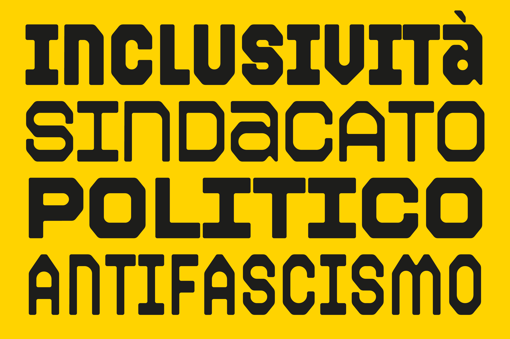

# Riottosa



Riottosa is an open source variable typeface designed for collective, cultural and activist visual communication.

## About

Riottosa is an open source unicase variable display typeface with horizontal contrast, developed across two interpolation axes and built from four masters: Regular Condensed, Bold Condensed, Regular Wide and Bold Wide.

Originally conceived as a proprietary typeface, Riottosa was designed to support the communication practices of the collective OSA, embracing the same spirit of openness, accessibility and sharing that later led to its release under the SIL Open Font License.

The typeface draws inspiration from Fontivegge, a district of Perugia shaped by its industrial past and rationalist architecture. This context informed a visual language that feels tough, dense and sometimes abrasive, while still preserving a warm and deeply human character aligned with the project’s social and community-oriented nature.

Formally, Riottosa combines constructivist influences with elements derived from vernacular graphics and workers’ visual culture. Its compact letterforms evoke posters, signs and wall writings, turning typography into a performative and identity-driven device.

The unicase approach reflects an attempt to flatten formal hierarchies and give the typeface a more collective and militant voice. Balancing rigour and spontaneity, historical memory and contemporary openness, Riottosa aims to embody the energy of the neighbourhood and transform it into a shared visual language.

---

## Features

- OpenType features
- Variable font support
- Stylistic sets
- Multilingual support
- Latin character set

---

## Supported Languages

Riottosa supports major Western European languages, including English, Italian, French, German, Spanish, Portuguese, Dutch and Scandinavian languages.

---

## Repository Structure

```txt
.
├── LICENSE
├── README.md
├── FONTLOG.txt
├── docs/
├── sources/
├── fonts/
│   ├── otf/
│   ├── variable/
│   └── web/
└── scripts/
```

### Suggested folders

- `sources/` → editable Glyphs source files
- `fonts/otf/` → static desktop font files
- `fonts/variable/` → variable font files for desktop and web use
- `fonts/web/` → static WOFF2 webfont exports
- `docs/` → documentation and visual assets
- `scripts/` → build and utility scripts

---

## Installation

### Desktop

1. Download the latest release.
2. Install the `.otf` or `.ttf` files.
3. Restart your design applications if needed.

### Web

```css
@font-face {
  font-family: 'Riottosa';
  src:
    url('fonts/variable/RiottosaVF.woff2') format('woff2'),
    url('fonts/variable/RiottosaVF.woff') format('woff');
  font-weight: 0 100;
  font-stretch: 0% 100%;
  font-style: normal;
}
```

Example usage:

```css
.hero-title {
  font-family: 'Riottosa', sans-serif;
  font-variation-settings:
    'wght' 85,
    'wdth' 20;
}
```

---

## Building the Font

Describe here:

- the software used;
- build scripts;
- dependencies;
- export workflow.

Example:

```bash
fontmake -g sources/FontName.glyphs -o variable
```

---

## License

This project is licensed under the SIL Open Font License 1.1.

See the [LICENSE](LICENSE) file for details.

---

## Authors

Designed by Marco Goran Romano.

---

## Version History

### v1.0

- Initial release

---

## Contact

- Website: https://www.marcogoranromano.com
- Instagram: https://wwww.instagram.com/marcogoranromano | @marcogoranromano
- GitHub: https://github.com/marcogoranromano

